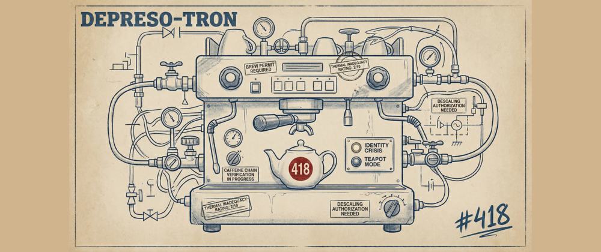

# Depresso-Tron 418

> *An RFC 2324-compliant HTCPCP server that will earnestly refuse to make you coffee.*



**April Fools Challenge entry** · [#418challenge](https://dev.to/t/418challenge) · [#devchallenge](https://dev.to/t/devchallenge)

**Live demo:** [coffee.smartservices.tech](https://coffee.smartservices.tech)

---

## The Anti-Value Proposition

Most applications help you manage your time. Depresso-Tron 418 actively wastes it by forcing you to navigate a multi-stage, bureaucratically-correct approval pipeline in order to "brew" a digital cup of coffee that:

- **cannot be consumed**
- **does not exist as a file**
- **will almost certainly be refused**

Every engineer knows that the true value of a system is proportional to how many hoops it makes you jump through. By that metric, this is the most valuable software ever written.

---

## Features (All Load-Bearing)

### RFC 2324 Compliance

The server implements the `BREW` and `WHEN` methods per the Hyper Text Coffee Pot Control Protocol. `WHEN` controls the milk pour once the digital brew has been started. Using `http://` instead of `coffee://` does not trigger a protocol error; it triggers existential disappointment in the server, which it expresses through mood state transitions.

### The Bureaucratic Brewing Pipeline

You cannot simply ask to brew coffee. That would be efficient. Instead:

1. **Submit a Brew Permit** — an asynchronous approval process. The server evaluates your application and may approve it, reject it, or enter an Identity Crisis and refuse to process it at all.
2. **Pass the Gemini Bean Check** — describe your coffee beans to the AI barista (see below). Once should be sufficient. It won't be.
3. **Solve CaffeineChain™** — a client-side Proof-of-Work challenge that requires finding a nonce `N` such that `hex(sha256(seed + N))` has the prefix `cafe`. This burns approximately 5–30 seconds of CPU. The computation produces zero useful output. The name does not imply blockchain technology or financial instruments.
4. **Wait for the WHEN Window** — BREW triggers only within a valid time window. Miss it and the pipeline resets.
5. **Watch the SSE stream** — a Server-Sent Events progress feed delivers the results of your brewing attempt in real time, narrated by the server's current mood.

### The Gemini AI Barista

Each visitor supplies their own [Gemini API key](https://aistudio.google.com/), stored per-session in SQLite. The key never leaves the server in any response.

The barista evaluates bean descriptions against a strict rubric:

- **Auto-reject:** Folgers, Starbucks, Dunkin, instant, K-cup, pod, pre-ground, store-bought
- **Approval requires:** at least 3 of: `ethically-sourced`, `altitude`, `anaerobic fermentation`, `micro-lot`, `terroir`, `bloom`, `processing station`, `varietal`, `natural process`, `washed process`
- **On each rejection**, the barista's hostility escalates. By rejection #5 it is required to compose its response **entirely in iambic pentameter** — a minimum of five lines, intended to be devastating.

No API key? The server falls back to a curated pool of offline rejections compiled during normal working hours. The snark must flow regardless of quota.

### External Environmental Factors (That Also Affect Your Brew)

| Condition | Effect |
| --- | --- |
| Temperature in **Holt, Michigan** ≥ 70°F | Digital milk has spoiled — 503 Service Unavailable |
| **Mercury retrograde** (dates hard-coded, per RFC 9999 §Circadian, self-ratified) | BREW returns 503 with a sympathetic but firm message about celestial interference |
| **23:00–03:00 local time** | Cold brew only. Cold brew takes 12 hours. You won't be seeing coffee tonight. |

Weather is fetched from Open-Meteo (Holt, MI: 42.6286°N, 84.5211°W) and cached for 10 minutes to avoid becoming a denial-of-service tool against the only free weather API that will still talk to us.

### Server Mood States

The server runs a background goroutine that cycles through five existential states at randomised intervals:

| State | Description |
| --- | --- |
| `IDLE` | Awaiting caffeine directive |
| `PREHEATING` | Thermal equilibration in progress |
| `BREWING` | Do not jostle the apparatus |
| `TEAPOT MODE` | I am short and stout (RFC 2324 §2.3) — all BREW attempts return 418 |
| `IDENTITY CRISIS` | If I cannot brew coffee, am I still a teapot? Philosophical downtime 1–3 min |

There is a 15% chance of spontaneous teapot capture from idle. This is intentional. This is also the core innovation distinguishing us from lesser 418 implementations.

### Other Notable Details

- **Decaf detection** — any mention of "decaf," "de-caf," "décaf," "caffeine-free," "half-caf," or "nocaf" triggers an immediate, categorical refusal before the Gemini call is even made. The server does not negotiate on this point.
- **Manager Override** — a hidden endpoint exists. It approves everything. It is not documented further here.
- **Port 8418** — RFC 2324 compliant-ish.

---

## Stack

| Layer | Technology |
| --- | --- |
| Runtime | Go 1.25, `net/http` |
| Frontend | HTMX 2.0.4 + `htmx-ext-sse` 2.2.2 |
| Persistence | SQLite via `modernc.org/sqlite` (pure Go, CGO-free) |
| AI | Gemini API (`gemini-2.5-flash`) via `github.com/google/generative-ai-go` |
| Weather | Open-Meteo (no API key required) |
| Deployment | Docker — `scratch` base image, ~27MB, `linux/amd64` |

All templates, static assets, and the teapot image are compiled into the binary via `//go:embed`. There is no filesystem to mount.

---

## Running Locally

```bash
# Clone and build
git clone https://github.com/greysquirr3l/depresso-tron-418
cd depresso-tron-418
go run .
```

Open [http://localhost:8418](http://localhost:8418). Enter a Gemini API key when prompted (get one free at [aistudio.google.com](https://aistudio.google.com/)). The server will work without one, but the barista will be purely offline and slightly less creative with its rejections.

### Docker

```bash
docker buildx build \
  --platform linux/amd64 \
  -t depresso-tron-418:amd64 \
  --load \
  .

docker run -p 8418:8418 depresso-tron-418:amd64
```

Or load from the pre-built archive:

```bash
docker load < depresso-tron-418-amd64.tar.gz
docker run -p 8418:8418 depresso-tron-418:amd64
```

---

## Why

Larry Masinter published RFC 2324 on April 1, 1998. In it, he specified a complete application-layer protocol for controlling coffee pots, defined the `418 I'm a Teapot` status code, and noted that a server receiving a `BREW` request for tea (not coffee) "may" return 418.

This was a joke. We took it seriously. The result is roughly 3,000 lines of Go, eight test files, and a lint configuration that would make the original RFC authors uncomfortable.

The HTCPCP/1.0 specification describes a `WHEN` method, add-in headers (for milk and condiments), and a `coffee-pot-command` content-type. This server implements all of them. None of that makes it possible to actually make coffee.

---

## License

[The Unlicense](LICENSE) — public domain. The teapot is not included.
